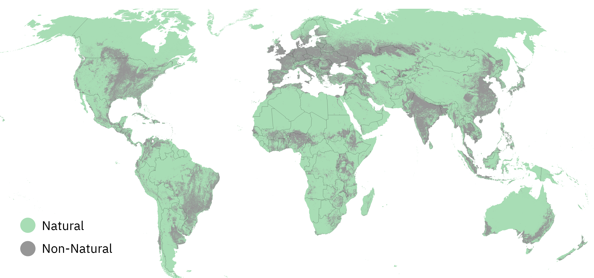

## Natural Lands Map 

This map was created by World Resources Institute’s Land and Carbon Lab in collaboration with WWF and Systemiq for the Science Based Target Network's [Land Targets](https://sciencebasedtargetsnetwork.org/how-it-works/set-targets/). The map is intended to be used by companies as a 2020 baseline for setting Target 1: “No conversion of natural ecosystems”. 

Full technical documentation for the Natural Lands Map is available [at this link](https://sciencebasedtargetsnetwork.org/wp-content/uploads/2023/05/Technical-Guidance-2023-Step3-Land-v0.3-Natural-Lands-Map.pdf). 

The Natural Lands Map was created in [Google Earth Engine](https://earthengine.google.com/) (GEE). This repository contains the script for creating the full Natural Lands Map and pre-processing scripts for some input datasets. Input datasets that were not already available in GEE as a public asset were ingested in their original data format, and all subsequent processing steps are included in the code. The exception is the Spatial Database of Planted Trees, version 2, which was rasterized at 30m resolution from vector format via the GFW Data API.  

The Natural Lands Map will be updated as improved input data become available.  

### Citation 

Mazur, E., M. Sims, E. Goldman, M. Schneider, F. Stolle, M.D. Pirri, C.R. Beatty. 2023. “SBTN Natural Lands Map: Technical Documentation”. *Science Based Targets for Land Version 0.3-- Supplementary Material*. Science Based Targets Network. https://sciencebasedtargetsnetwork.org/wp-content/uploads/2023/05/Technical-Guidance-2023-Step3-Land-v0.3-Natural-Lands-Map.pdf 

### GEE application 

The map can be viewed online via a Google Earth Engine Application [here](https://wri-datalab.earthengine.app/view/sbtn-natural-lands).  

### Contact 

Elise Mazur: elise.mazur@wri.org 

Michelle Sims: michelle.sims@wri.org 
